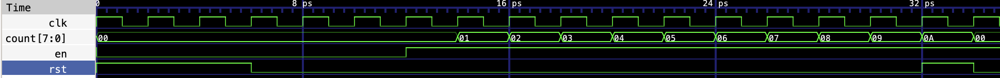
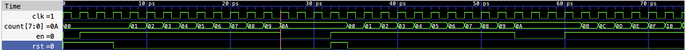
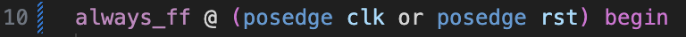
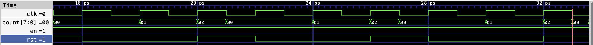
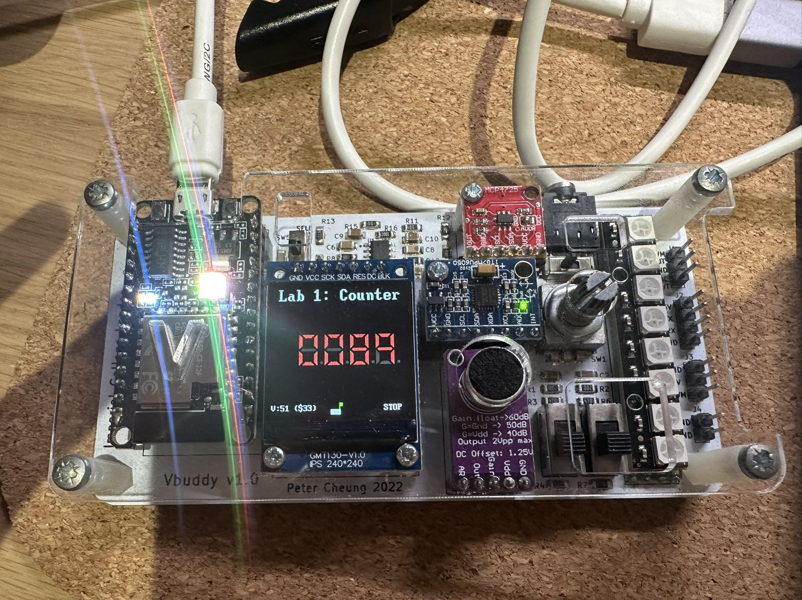
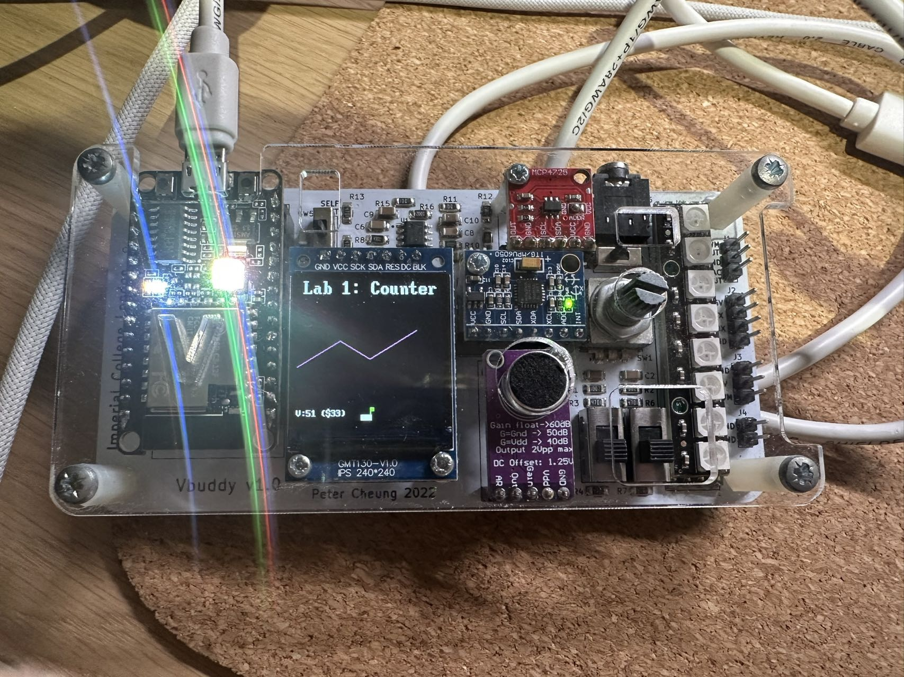

# Lab1-Counter logbook
## Task1: Simulating a basic 8-bit binary counter
### Task1 counter wave

- clk cycles starts from 0, clk, rst, en are set to be 1, 1, 0 respectively at the begining of the cycle
- rst is set to be 1 only when i < 2 or i ==15
- en is set to be 1 when i > 4

### Task1 challenge
1. Modify the testbench so that you stop counting for 3 cycles once the counter reaches 0x9, and then resume counting. You may also need to change the stimulus for rst.

  
1. The current counter has a synchronous reset. To implement asynchronous reset, you can change line 11 of counter.sv to detect change in rst signal.

## Task2: Linking Verilator simulation with Vbuddy

### Task2: challenge

## Task3: Vbuddy parameter & flag in one-shot mode

## Task4: Displaying count as Binary coded Decimal (BCD) numbers

